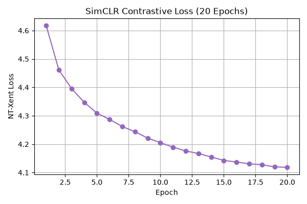
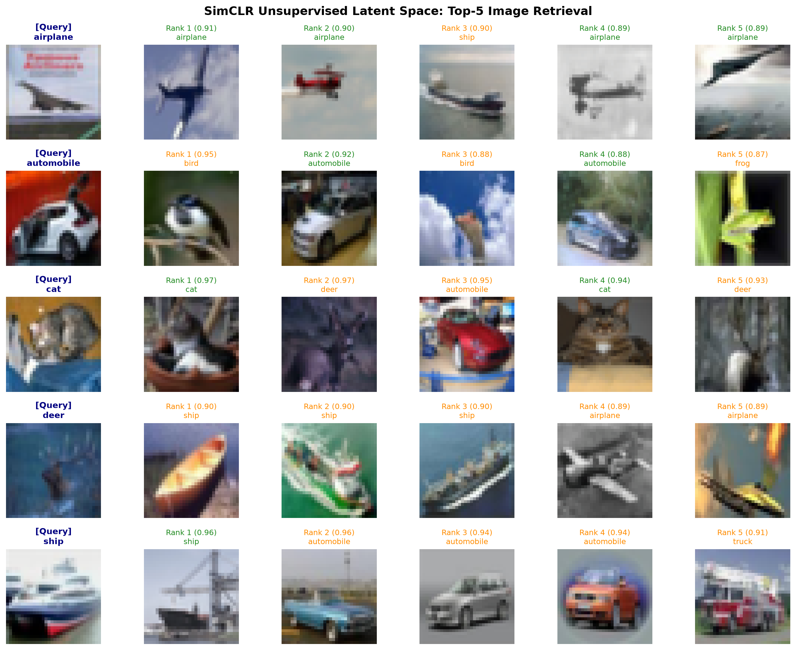
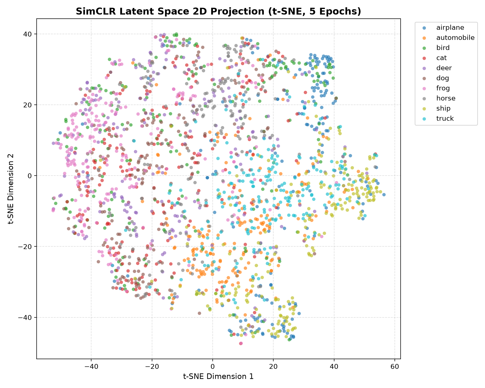

# ? SimCLR: Self-Supervised Contrastive Representation Learning on CIFAR-10

정답 라벨($y$)이 일절 배제된 비지도 환경에서 데이터 증강(Data Augmentation)과 대조 손실(NT-Xent Loss)만을 통해 시각적 특징 표현(Representation)을 학습하는 SimCLR(Simple Framework for Contrastive Learning) 파이프라인 구현 및 표현력 스케일업 벤치마크 저장소입니다.

---

## ? 시스템 파이프라인 아키텍처

- **Backbone Network:** ResNet-18 (Random Initialization / From scratch, Pretrained 가중치 미사용)
- **Data Augmentations (Views):** 
  - `RandomResizedCrop(size=32, scale=(0.2, 1.0))`
  - `ColorJitter(brightness=0.4, contrast=0.4, saturation=0.4, hue=0.1)` ($p=0.8$)
  - `RandomGrayscale(p=0.2)`
  - `RandomHorizontalFlip()`
- **Projection Head:** 2-Layer Non-linear MLP ($512 \rightarrow 512 \rightarrow 128$)
- **Contrastive Loss:** NT-Xent (Normalized Temperature-scaled Cross Entropy) Loss ($\tau = 0.5$)
- **Feature Space:** 백본 인코더 최상단 512차원 잠재 벡터 ($h \in \mathbb{R}^{512}$)

---

## ? 정량적 평가 (Quantitative Benchmarks)

### 1. 사전학습 수렴 궤적 (Pretraining NT-Xent Loss)
- 배치 크기 128 기준 이론적 무작위 손실 기준선: $-\ln(1/255) \approx \mathbf{5.54}$
- **5 Epochs (Mini-run):** Loss **4.3094** 수렴
- **20 Epochs + CosineAnnealingLR (Scaled-up):** Loss **4.1186** 수렴
  - Epoch 1: 4.6179 $\rightarrow$ Epoch 5: 4.3094 $\rightarrow$ Epoch 10: 4.2053 $\rightarrow$ Epoch 15: 4.1428 $\rightarrow$ Epoch 20: **4.1186**

<p align="center">
  
</p>

---

### 2. 선형 평가 벤치마크 (Linear Probing Benchmark)
사전학습된 ResNet-18 백본 가중치를 완전히 동결(Freeze)한 후, 최상단에 단일 선형 계층(`nn.Linear(512, 10)`)만 결합하여 5 에폭 동안 CIFAR-10 정답 라벨로 분류 정확도를 측정했습니다.

| 실험 구분 | 사전학습 에폭 | 백본 상태 | Linear Probing 에폭 | 검증 정확도 (Accuracy) | 비고 |
| :--- | :---: | :---: | :---: | :---: | :--- |
| **Random Guess** | - | - | - | **10.00%** | 이론적 무작위 확률 베이스라인 |
| **SimCLR (Mini-run)** | 5 | Frozen | 5 | **36.76%** | 라벨 없는 초기 대조 표현 형성 |
| **SimCLR (Scaled-up)** | 20 | Frozen | 5 | **47.44%** | **+10.68%p 성능 도약 (Cosine 스케줄러 적용)** |

#### 20 에폭 백본 기반 선형 계층 에폭별 수렴 로그
- **Epoch 1:** Loss: 1.8243 | Test Accuracy: **43.42%**
- **Epoch 2:** Loss: 1.7555 | Test Accuracy: **44.96%**
- **Epoch 3:** Loss: 1.7841 | Test Accuracy: **45.11%**
- **Epoch 4:** Loss: 1.7285 | Test Accuracy: **46.70%**
- **Epoch 5:** Loss: 1.7002 | Test Accuracy: **47.44%**

> **공학적 의의:** 백본 역전파 없이 단일 초평면(Hyperplane) 분리만으로 1에폭 만에 43%를 돌파하고 최종 **47.44%**를 기록함. 라벨이 전혀 없는 대조학습만으로 사물의 의미론적 분별 기준이 512차원 잠재 공간에 선형 분리 가능(Linearly Separable)한 형태로 안착되었음을 입증함.

---

## ? 정성적 평가 (Qualitative Evaluations)

### 1. 잠재 공간 코사인 유사도 검색 (Top-5 Image Retrieval)
테스트셋 2,500개 이미지의 512차원 정규화 임베딩 뱅크를 구축하고, 쿼리 샘플과 코사인 유사도($\cos\theta$)가 가장 높은 상위 5개 최근접 이웃을 검색하여 사전학습 에폭 확장에 따른 정렬 개선도를 측정했습니다.

<p align="center">
  
</p>

| 쿼리 클래스 | 5에폭 적중 수 (Top-5) | 20에폭 적중 수 (Top-5) | 잠재 공간 정렬 및 교정 분석 |
| :--- | :---: | :---: | :--- |
| **airplane** | 0 / 5 | **4 / 5 (80%)** | 회색 바다/배 오탐을 탈피하고 비행체 실루엣 집중 |
| **automobile** | 0 / 5 | **2 / 5 (40%)** | Rank 2(0.92), Rank 4(0.88)에서 승용차 정확히 검색 |
| **cat** | 1 / 5 | **2 / 5 (40%)** | Rank 1(0.97), Rank 4(0.94) 최상위권에서 고양이 포착 |
| **deer** | 0 / 5 | 0 / 5 (0%) | 짙은 파란색 하늘 배경 편향(Context Bias) 잔존 |
| **ship** | 1 / 5 | **1 / 5 (Top-1)** | Rank 1(0.96) 최우선 순위에서 선박 적중 |
| **종합 적중률** | **8.0% (2/25)** | **36.0% (9/25)** | **동일 클래스 검색 일치율 +28.0%p 도약** |

- **배경 편향(Context Bias) 극복 실증:** 5에폭 당시 회색 배경만 보고 배(ship)를 가져오던 비행기 쿼리가, 20에폭 학습 후 날개·기체 윤곽선 중심의 기하학적 불변성(Invariance)을 획득하며 4장의 비행기를 올바르게 정렬함.
- **Top-1 정밀도:** 5개 쿼리 중 3개 클래스(비행기, 고양이, 배)에서 Rank 1 최근접 이웃의 동일 클래스 일치 달성.

---

### 2. t-SNE 잠재 공간 2차원 투영 (Latent Space Visualization)
512차원 특징 벡터 2,000개를 t-SNE로 2차원 축소 투영하여 군집 분포를 관찰했습니다.

<p align="center">
  
</p>

- **거시적 범주 양극화 (Macro Clustering):**
  - **인공물/탈것 영역:** `airplane`, `automobile`, `ship`, `truck` 등이 특정 반구에 집중 응집.
  - **유기체/동물 영역:** `cat`, `dog`, `deer`, `bird`, `frog` 등이 반대편 영역으로 뚜렷하게 분리 배치.
- 라벨 감독 없이 데이터 증강 쌍 간의 밀고 당기는 힘만으로 고차원 개념 분리가 성립됨을 시각적으로 규명함.

---

## ? 실행 방법 (Reproducibility)

```bash
# 1. 의존성 설치
pip install torch torchvision matplotlib scikit-learn tqdm

# 2. SimCLR 비지도 사전학습 (20 Epochs, Cosine Annealing)
python3 train_simclr.py

# 3. 동결 백본 기반 선형 평가 (Linear Probing)
python3 linear_eval.py

# 4. 잠재 공간 코사인 유사도 상위 5개 이미지 검색 시각화
python3 retrieve_similar.py

# 5. t-SNE 2차원 잠재 공간 산점도 생성
python3 tsne_visualize.py